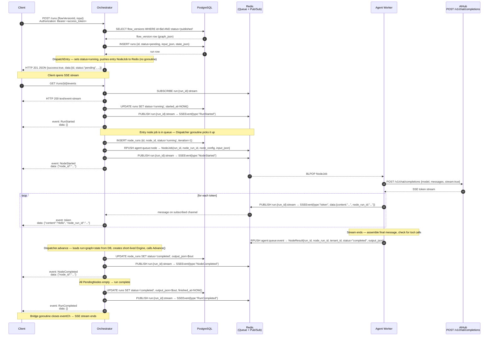
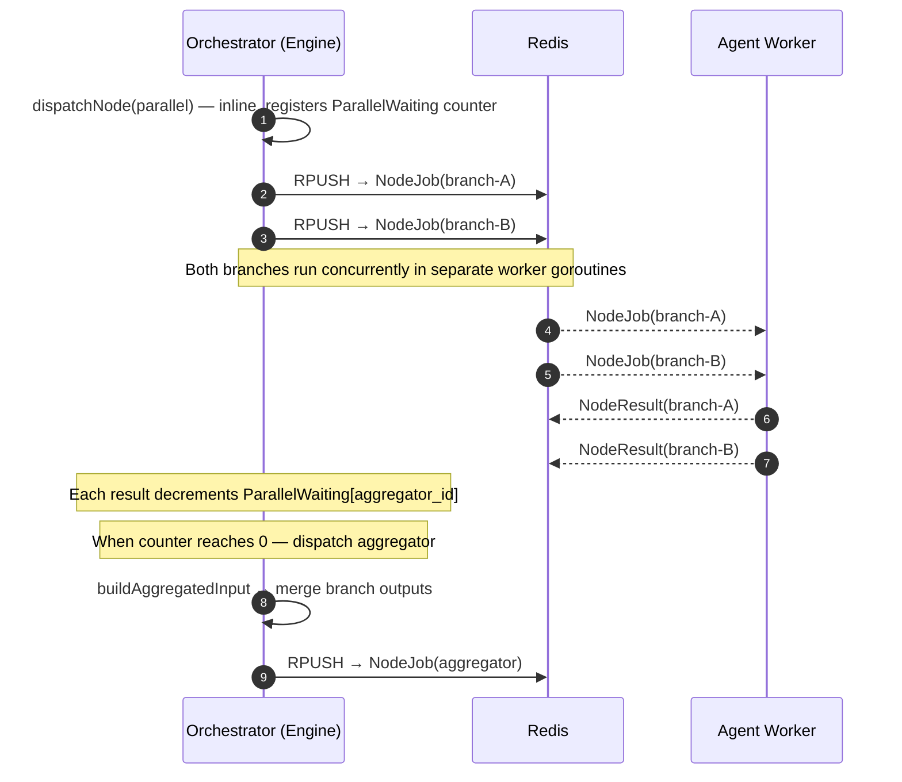
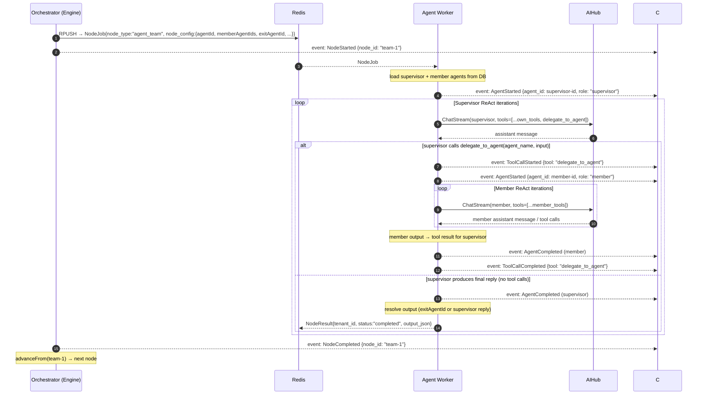
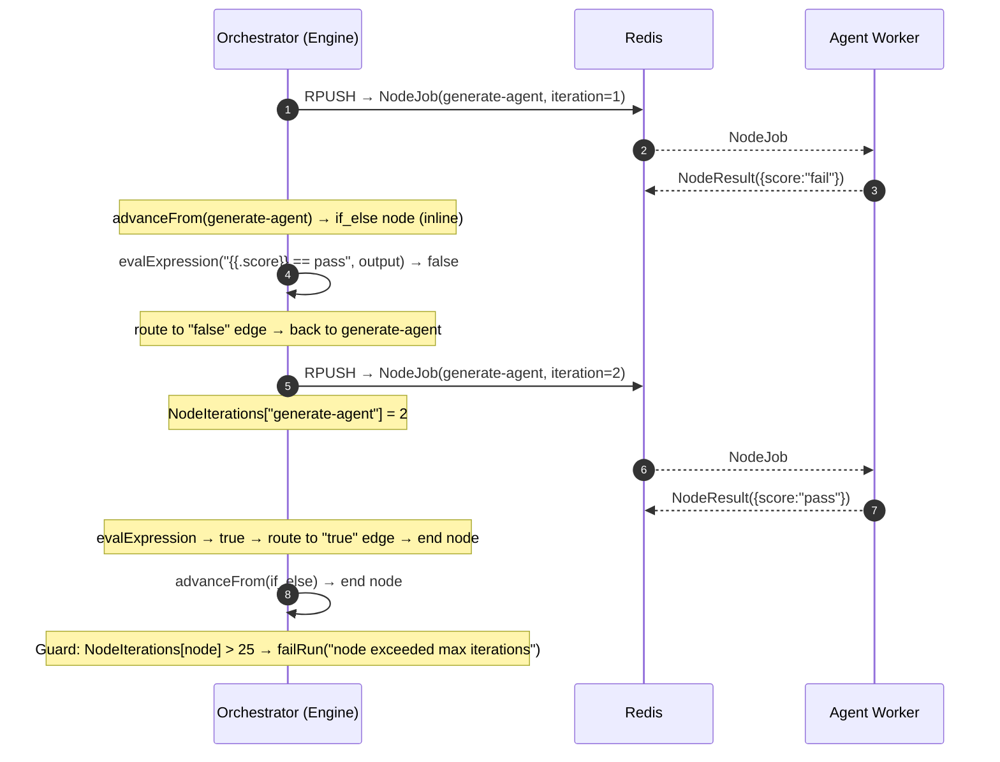

# Agent Layer — Run Execution Sequence

An agent run is created with `POST /runs`, which returns a JSON `RunResponse`.  
The client then opens `GET /runs/{id}/events` to receive all execution events as an SSE stream.

---

## Happy Path — Single Agent Node



---

## Multi-Node Flow (Sequential)

Each node completes before the next is dispatched. The engine advances via outgoing edges.

```mermaid
sequenceDiagram
    autonumber
    participant C as Client
    participant OR as Orchestrator (Engine)
    participant Redis as Redis
    participant WK as Agent Worker

    Note over C,OR: POST /runs → 201 JSON; client opens GET /runs/{id}/events (SSE)

    OR->>OR: dispatchNode(start)  — inline, no worker
    OR-->>C: event: NodeStarted / NodeCompleted (start node)

    OR->>Redis: RPUSH → NodeJob for node-A
    OR-->>C: event: NodeStarted (node-A)

    Redis-->>WK: NodeJob (node-A)
    WK-->>Redis: NodeResult (node-A, completed, tenant_id)

    OR->>Redis: RPUSH → NodeJob for node-B
    OR-->>C: event: NodeCompleted (node-A)<br/>event: NodeStarted (node-B)

    Redis-->>WK: NodeJob (node-B)
    WK-->>Redis: NodeResult (node-B, completed, tenant_id)

    Note over OR: Dispatcher.advance loads state from DB for each result
    OR-->>C: event: NodeCompleted (node-B)<br/>event: NodeCompleted (end node)<br/>event: RunCompleted
```

---

## Parallel Fan-Out + Aggregator



---

## Hierarchical Team (agent_team node)

The `agent_team` node is dispatched to the **Agent Worker** as a single job. The worker handles supervisor/member coordination internally. From the orchestrator's perspective it behaves identically to an `agent` node — one `NodeJob` in, one `NodeResult` out.

### Supervisor-handoff loop

The worker injects a synthetic `delegate_to_agent` tool into the supervisor's tool list. The tool's schema contains an `agent_name` enum listing every member agent by name. When the supervisor calls `delegate_to_agent`, the worker runs the named member's full ReAct loop (with its own tools) and returns the output as the tool result. The supervisor can delegate multiple times before producing a final reply.

**Final output resolution:**
- If `exitAgentId` is set and the last agent that ran was the exit agent → that agent's output is returned.
- Otherwise → the supervisor's final text reply is returned.



### Config fields

The `agentId` field in `node_config.data` must be the **supervisor** agent UUID. The canvas form writes both `agentId` and `entryAgentId` to the same value when the supervisor is selected.

| Field | Required | Notes |
|---|:---:|---|
| `agentId` | ✓ | Supervisor agent UUID |
| `memberAgentIds` | ✓ | Pool of agents the supervisor can delegate to |
| `exitAgentId` | — | If set and that agent ran last, its output is returned instead of the supervisor's reply |
| `maxIterations` | — | Max supervisor iterations (defaults to agent's own `max_iterations`, then global default of 10) |

---

## Self-Correct Loop (if_else back-edge)

The `if_else` node is dispatched **inline** by the orchestrator. It evaluates `data.ifExpression` against the previous node's `output_json` and routes to the `"true"` or `"false"` outgoing edge. A back-edge on the `"false"` branch re-dispatches the generator node.

The `NodeIterations` counter (max 25) prevents runaway loops.



---

## Worker Events Emitted During a Node Run

These appear as SSE events between `NodeStarted` and `NodeCompleted`:

| Event | When |
|---|---|
| `AgentStarted` | Agent loaded, ReAct loop begins |
| `AgentStepStarted` | Each ReAct iteration starts |
| `token` | Each LLM text token (high frequency) |
| `AgentStepCompleted` | LLM response assembled (finish_reason, iteration) |
| `ToolCallCompleted` | Each tool call finishes |
| `AgentCompleted` | Agent produced final output with no further tool calls |

---

## Run Status Lifecycle

```
pending → running → completed
                 ↘
                   failed
                 ↘
                   waiting_for_human → running → completed
                                               ↘ failed
                 ↘
                   cancelled
```

| Status | Set by | Condition |
|---|---|---|
| `pending` | Orchestrator API | On `POST /runs` |
| `running` | Engine | `SetStarted` at loop start |
| `waiting_for_human` | Engine | `HumanReviewRequested` event received |
| `completed` | Engine | All PendingNodes empty |
| `failed` | Engine | Any unrecoverable error |
| `cancelled` | API | `POST /runs/{id}/cancel` |

---

## Stateless Dispatcher Design

The orchestrator has **no in-memory per-run state**. There is no goroutine kept alive for the lifetime of a run.

```
POST /runs
  → CreateRun: INSERT run → Engine.DispatchEntry() → RPUSH entry NodeJob
  → return 201 (no goroutine spawned)

[N Dispatcher goroutines — any orchestrator instance]:
  BLPOP result queue
  → load run + graph + state from DB (GetByIDOnly)
  → assert result.TenantID == run.TenantID          ← reject mismatched results
  → NewEngine(run, graph, state, repos...)
  → eng.Advance(ctx, result)       ← pure: mutates state, writes to DB, dispatches next jobs
  → discard engine (GC)
```

**Consequences:**
- Orchestrator restarts are transparent — active runs resume automatically when the next `NodeResult` arrives on the queue.
- Multiple orchestrator replicas can process different run results simultaneously with no coordination.
- `RunState` in `runs.state_json` (Postgres JSONB) is the single source of truth; it is updated on every state mutation.
- `ResumeHumanReview` pushes a synthetic `NodeResult` directly onto the result queue instead of routing to an in-memory engine.

### Tenant Isolation in the Queue Path

Every `NodeResult` carries `tenant_id`. The field is stamped by the agent worker from the `NodeJob` it consumed (which in turn was stamped by the orchestrator from the originating run). The dispatcher validates this field before performing any state mutation:

```
result.TenantID ≠ run.TenantID  →  advance() returns error, result is dropped
```

A `NodeResult` pushed by a compromised worker or forged directly into Redis cannot advance a run belonging to a different tenant, because the mismatch is caught before the engine is created.

All run `UPDATE` statements (`UpdateStatus`, `UpdateState`, `UpdateOutput`, `UpdateError`, `SetStarted`) include `AND tenant_id = $N` in their `WHERE` clause, providing a second layer of isolation at the database level.
