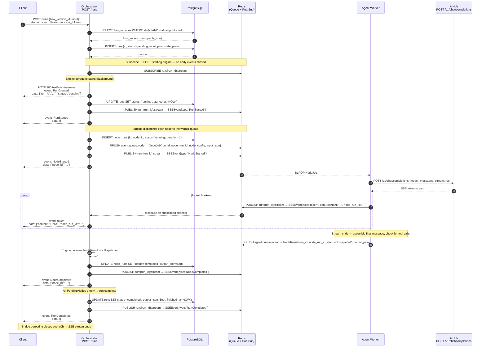
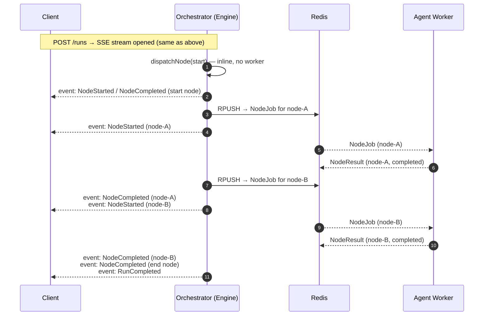
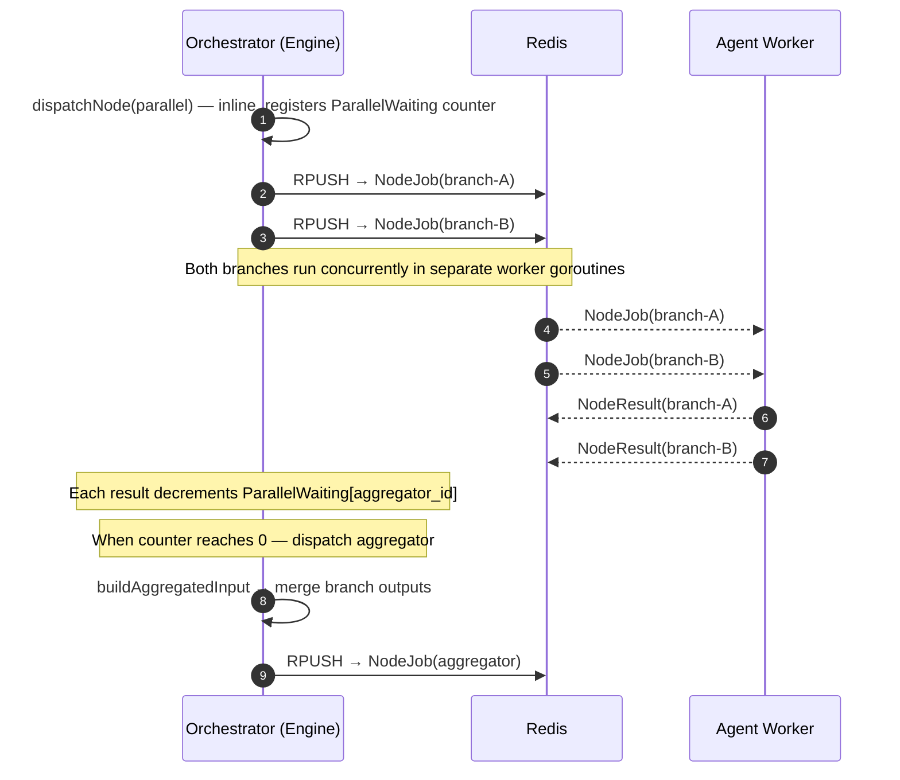
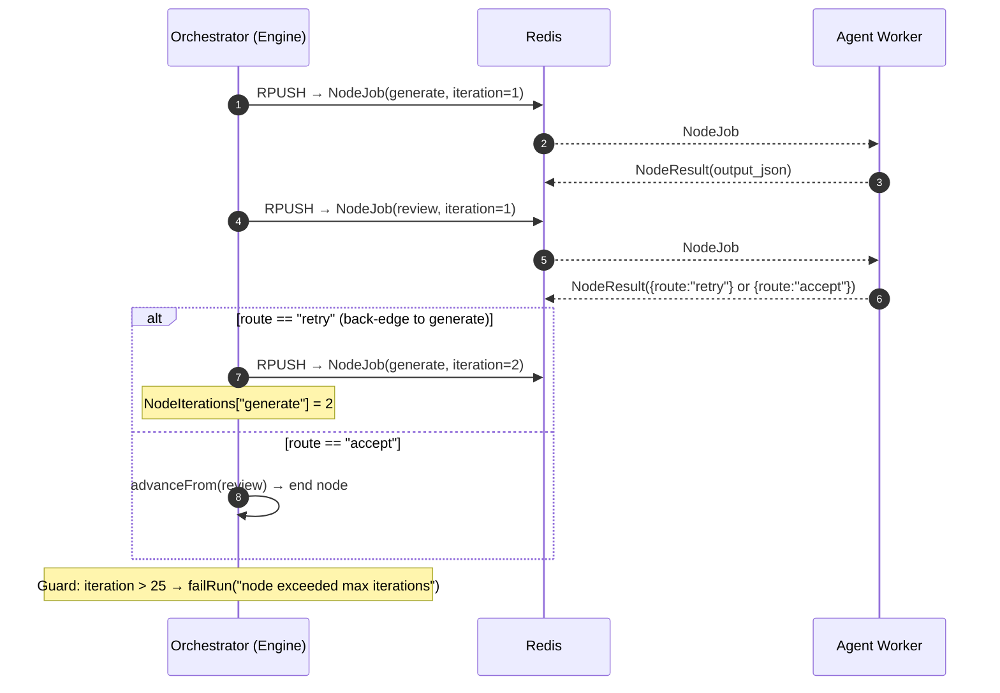

# Agent Layer — Run Execution Sequence

An agent run is created with a single `POST /runs` request.  
The response is an **SSE stream** that delivers all events in real-time until the run terminates.  
No separate GET is needed to start listening.

---

## Happy Path — Single Agent Node



---

## Multi-Node Flow (Sequential)

Each node completes before the next is dispatched. The engine advances via outgoing edges.



---

## Parallel Fan-Out + Aggregator



---

## Self-Correct Loop (if_else back-edge)

The `NodeIterations` counter (max 25) prevents runaway loops.



---

## Worker Events Emitted During a Node Run

These appear as SSE events between `NodeStarted` and `NodeCompleted`:

| Event | When |
|---|---|
| `AgentStarted` | Agent loaded, ReAct loop begins |
| `AgentStepStarted` | Each ReAct iteration starts |
| `token` | Each LLM text token (high frequency) |
| `AgentStepCompleted` | LLM response assembled (finish_reason, iteration) |
| `ToolCallCompleted` | Each tool call finishes |
| `AgentCompleted` | Agent produced final output with no further tool calls |

---

## Run Status Lifecycle

```
pending → running → completed
                 ↘
                   failed
                 ↘
                   waiting_for_human → running → completed
                                               ↘ failed
                 ↘
                   cancelled
```

| Status | Set by | Condition |
|---|---|---|
| `pending` | Orchestrator API | On `POST /runs` |
| `running` | Engine | `SetStarted` at loop start |
| `waiting_for_human` | Engine | `HumanReviewRequested` event received |
| `completed` | Engine | All PendingNodes empty |
| `failed` | Engine | Any unrecoverable error |
| `cancelled` | API | `POST /runs/{id}/cancel` |
