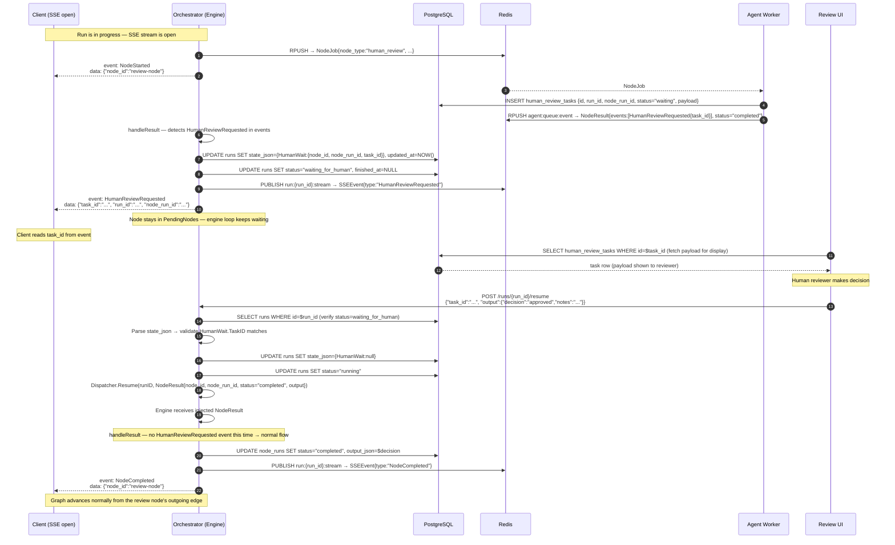

# Agent Layer — Human Review Flow

A `human_review` node pauses a run and waits for an external actor (e.g., a human reviewer via the UI) to provide a decision before the graph continues.

---

## Full Sequence



---

## State During Pause

While the run is `waiting_for_human`, the `runs.state_json` contains:

```json
{
  "completed_nodes": {"start": true, "node-A": true},
  "pending_nodes": {"review-node": true},
  "node_iterations": {"start": 1, "node-A": 1, "review-node": 1},
  "human_wait": {
    "node_id": "review-node",
    "node_run_id": "uuid",
    "task_id": "uuid"
  }
}
```

The `HumanWait` field is cleared when `POST /runs/{id}/resume` is called.

---

## Resume Validation

The orchestrator validates three things before injecting the result:

1. Run status must be `waiting_for_human`
2. `state_json.human_wait` must be non-null
3. `task_id` in the request body must match `state_json.human_wait.task_id`

If any check fails, a `400/500` JSON error is returned (not SSE).

---

## What Happens if the Engine Restarts?

The engine goroutine is in-memory only. If the orchestrator process restarts while a run is `waiting_for_human`:

- The `runs` row still has `status=waiting_for_human` and the `HumanWait` state in `state_json`
- `POST /runs/{id}/resume` will succeed at the DB level but `Dispatcher.Resume` will return `false` (engine not found)
- The API returns a 500 with message "engine not active for run — it may have been restarted"
- **Recovery**: a restart recovery mechanism is needed (re-hydrate engine from DB state). This is tracked as a known limitation.

---

## API Reference

### POST /runs/{id}/resume

Resumes a run waiting at a human_review node.

**Request:**
```json
{
  "task_id": "uuid",
  "output": {
    "decision": "approved",
    "notes": "Looks good"
  }
}
```

**Response (200):**
```json
{"status": "resumed"}
```

**Error cases:**
- `400` — `task_id` missing or zero
- `500` — run not in `waiting_for_human` status, task_id mismatch, or engine not active
