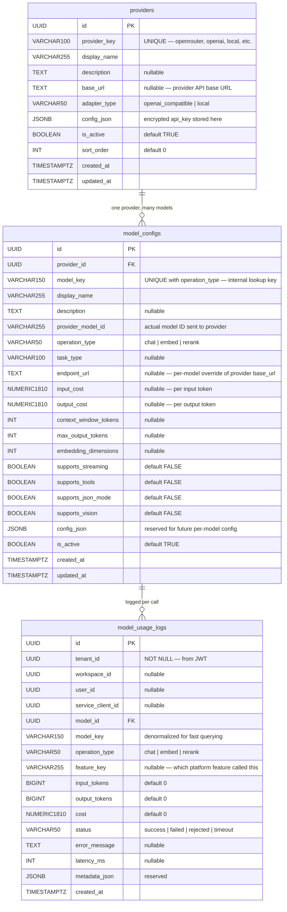

# AIHub — Database Schema

## Key design decisions

- `provider_key` is the stable external identifier (e.g. `openrouter`). The UUID `id` is only used for FK references.
- `model_key` + `operation_type` is unique — the same model name can appear as both `chat` and `embed` if the provider supports both operations.
- `provider_model_id` decouples AIHub's internal key from the upstream model identifier, so renaming a model at a provider only requires a DB update.
- `config_json` on `providers` stores the encrypted API key under `"api_key"`. The plaintext is only available in memory after decryption at startup.
- `model_usage_logs.tenant_id NOT NULL` — every log row is scoped to a tenant.
- `model_usage_logs.model_key` is denormalized so log queries don't require a JOIN with `model_configs`.
