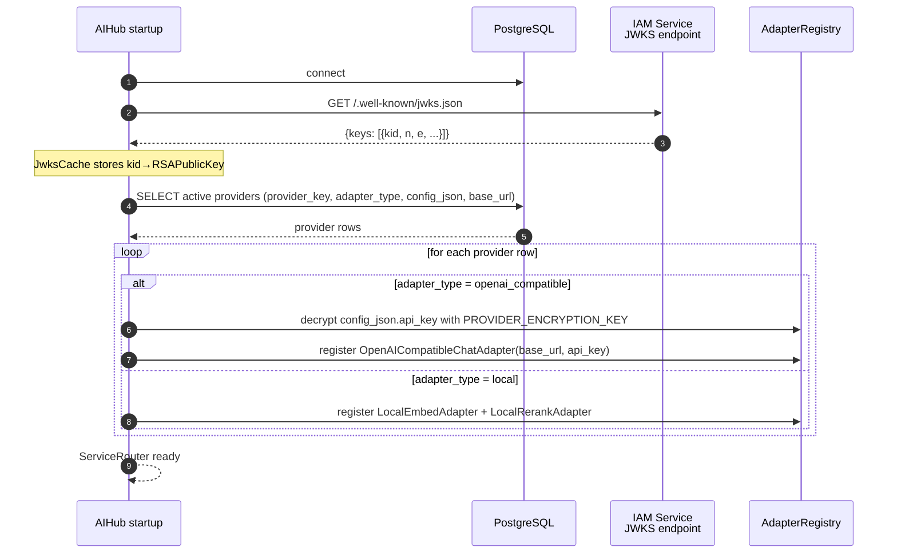
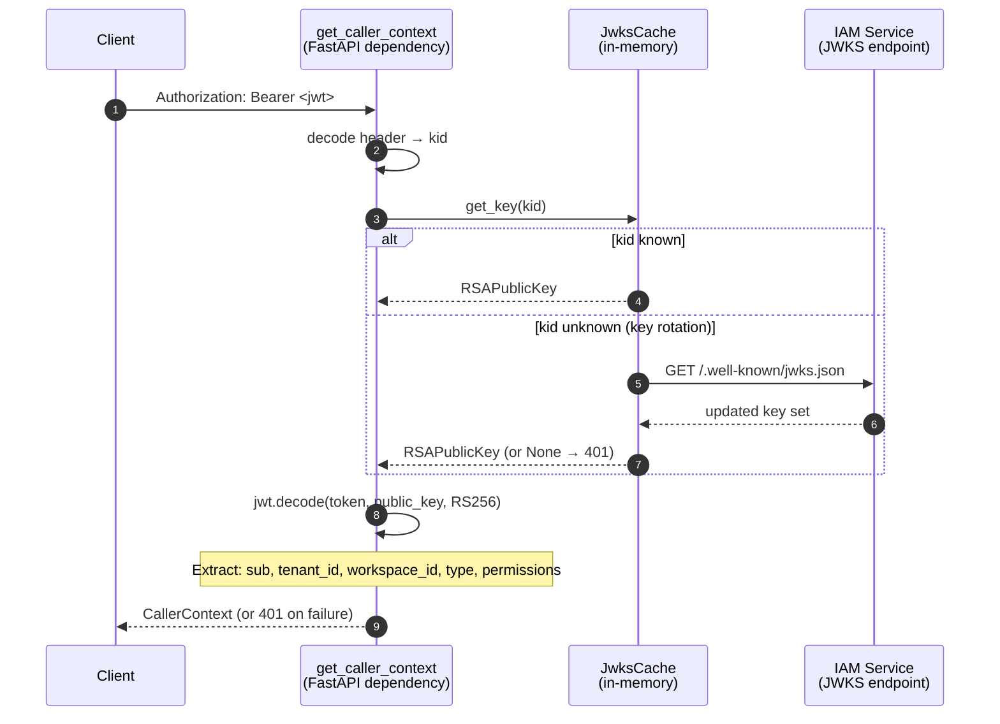
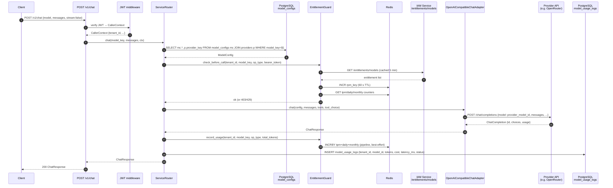
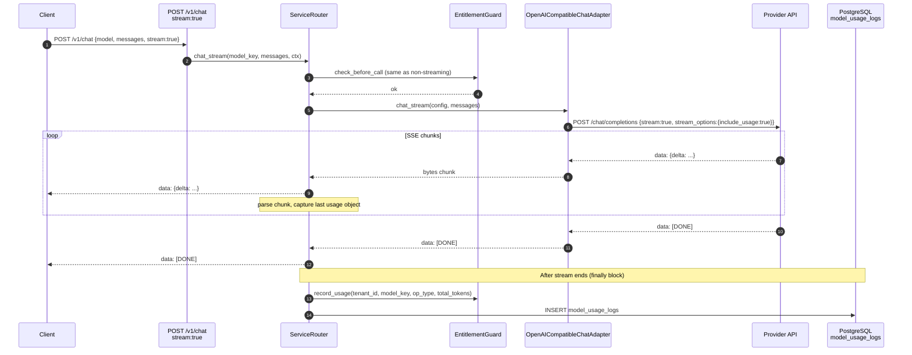
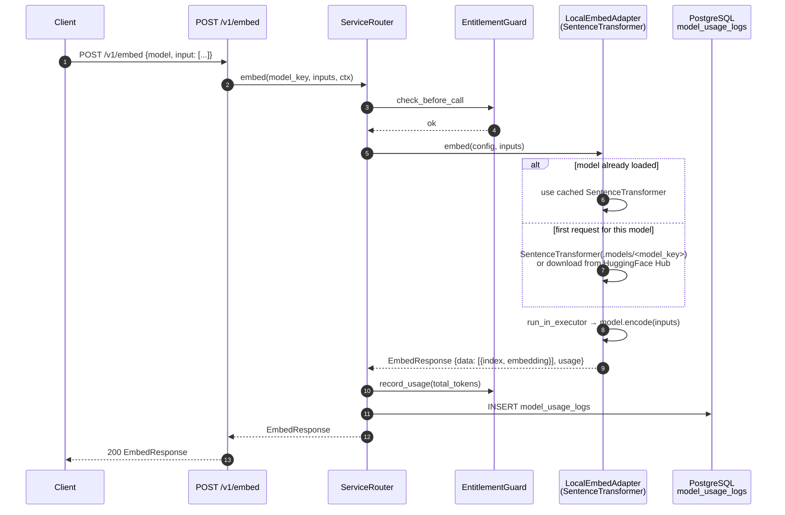
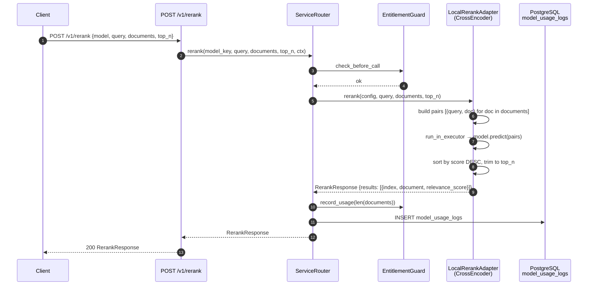
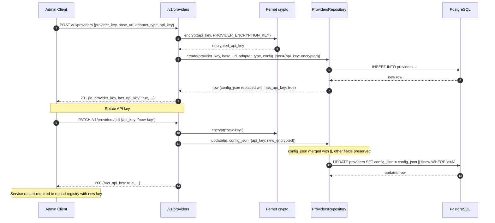
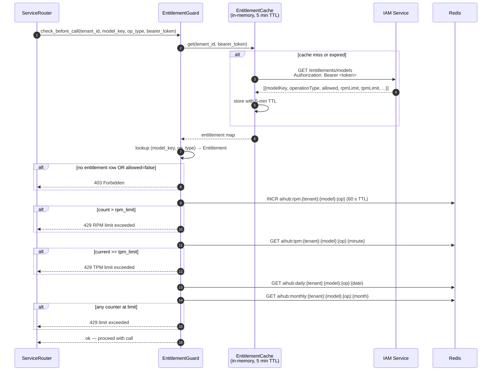

# AIHub — Sequence Diagrams

## 1. Startup — registry initialization

---

## 2. JWT authentication (every request)

---

## 3. Chat — non-streaming

---

## 4. Chat — streaming (SSE)

---

## 5. Embedding

---

## 6. Reranking

---

## 7. Provider CRUD

---

## 8. Entitlement check detail

