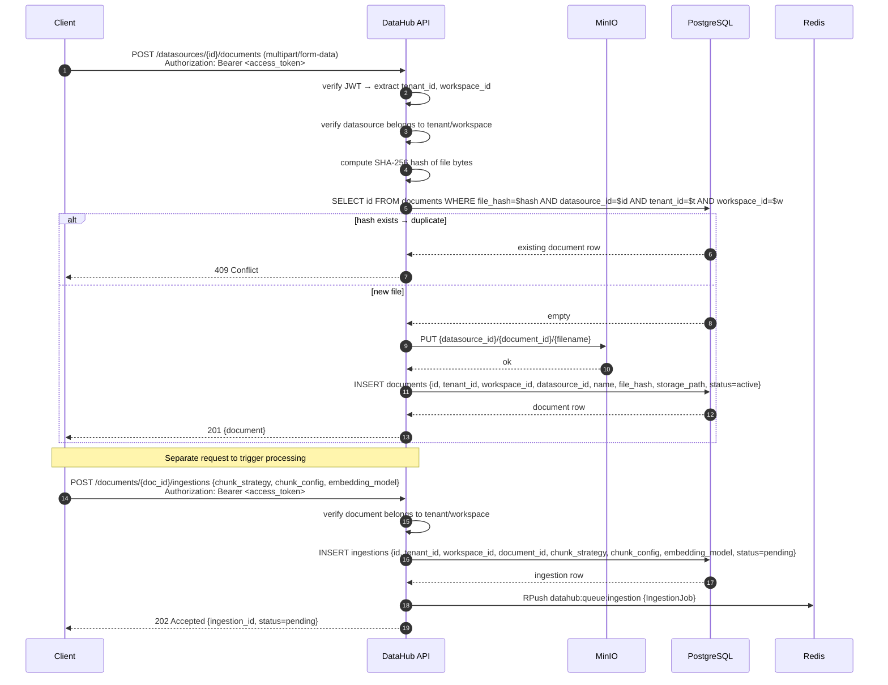
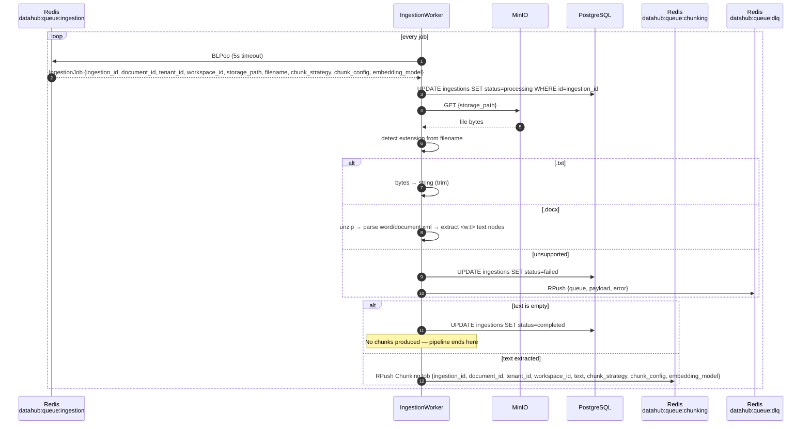
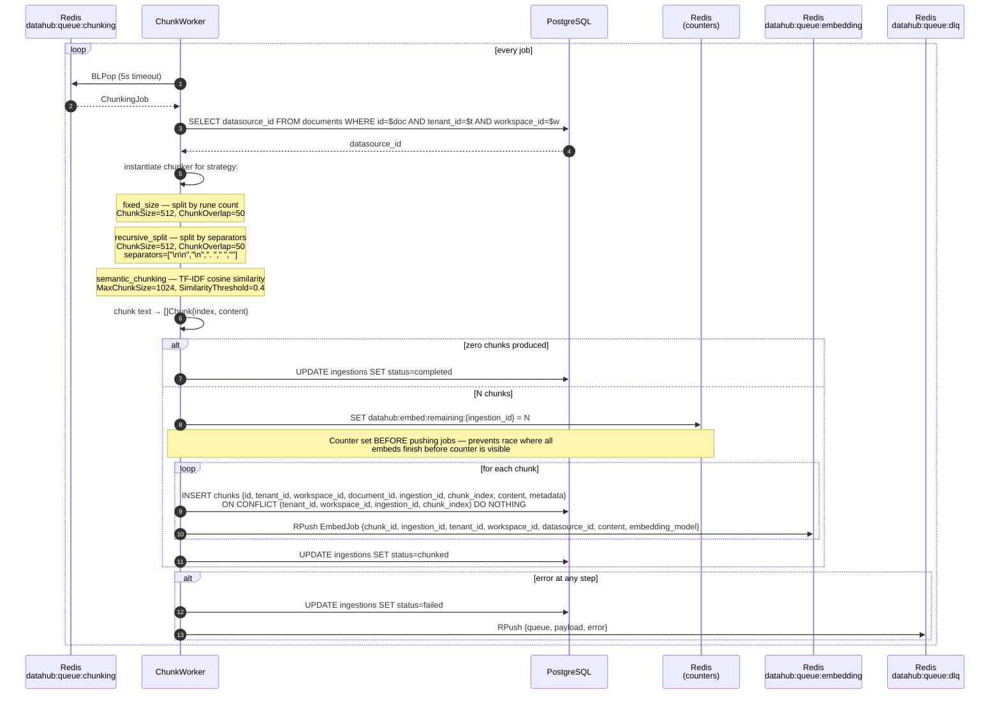
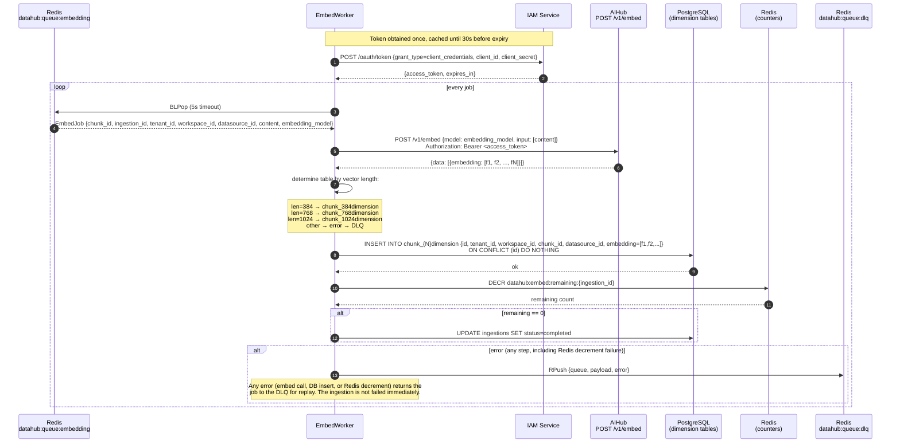

# Data Layer — Ingestion Sequence

Full pipeline from document upload to searchable embeddings.
Three Redis queues, three worker types, one PostgreSQL pool, one MinIO bucket.

---

## Phase 1 — Document Upload (DataHub API)



---

## Phase 2 — IngestionWorker: Download + Parse



---

## Phase 3 — ChunkWorker: Split + Persist Chunks



---

## Phase 4 — EmbedWorker: Vectorize + Store



---

## Full Pipeline at a Glance

```
Client
  │
  ├─ POST /datasources/{id}/documents    → MinIO + DB: document record
  │
  └─ POST /documents/{id}/ingestions     → DB: ingestion (pending)
                                          → Redis: IngestionJob
                                                        │
                                              IngestionWorker
                                              ├─ MinIO download
                                              ├─ parse text (.txt / .docx)
                                              └─ Redis: ChunkingJob (or → completed if empty)
                                                              │
                                                    ChunkWorker
                                                    ├─ fetch datasource_id (tenant-scoped)
                                                    ├─ split text by strategy
                                                    ├─ DB: INSERT N chunks
                                                    ├─ Redis: counter = N
                                                    ├─ Redis: N × EmbedJob
                                                    └─ DB: ingestion → chunked
                                                                    │
                                                            EmbedWorker (N concurrent)
                                                            ├─ IAM: /oauth/token (cached)
                                                            ├─ AIHub: /v1/embed → vector[dim]
                                                            ├─ DB: INSERT chunk_{dim}dimension
                                                            ├─ Redis: DECR counter
                                                            └─ if counter == 0 → DB: ingestion → completed
```

---

## Ingestion Status Lifecycle

```
pending → processing → chunked → completed
                    ↘               ↗
                      failed (any stage)
```

| Status | Set by | Condition |
|---|---|---|
| `pending` | DataHub API | On ingestion create |
| `processing` | IngestionWorker | Job dequeued |
| `completed` | IngestionWorker | Extracted text is empty |
| `chunked` | ChunkWorker | All chunks inserted + embed jobs queued |
| `completed` | EmbedWorker | Embed counter reaches 0 |
| `failed` | Any worker | Any unrecoverable error |

---

## Supported File Formats

| Extension | Parser | Notes |
|---|---|---|
| `.txt` | Direct bytes → string | Trimmed |
| `.docx` | ZIP → `word/document.xml` → `<w:t>` nodes | Concatenates all text runs |
| Other | Error | Ingestion fails immediately |
