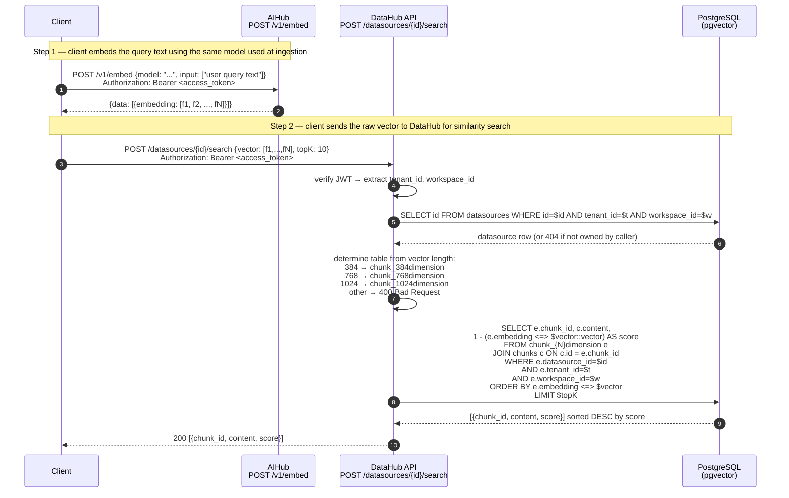
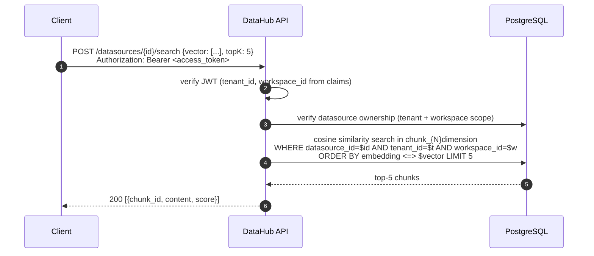

# Data Layer — Query / Vector Search Sequence

DataHub's search is **stateless with respect to AI models**: the caller must supply the query vector directly. DataHub does not call any embedding model at query time. This keeps the search endpoint fast, model-agnostic, and free of external dependencies on the hot path.

---

## Typical Client Flow (with embedding step)



---

## Single-Service Flow (caller already has the vector)

If the caller already holds a query vector (e.g., cached from a previous embed call or produced by a different service), they skip step 1 and call DataHub directly.



---

## Vector Index Details

Each dimension table has an **HNSW index** on the `embedding` column:

```sql
CREATE INDEX idx_chunk_384_embedding_hnsw
    ON chunk_384dimension USING hnsw (embedding vector_cosine_ops);
```

pgvector uses approximate nearest-neighbour search over this index. All WHERE clauses (`datasource_id`, `tenant_id`, `workspace_id`) are applied as post-filters after the ANN retrieval.

---

## Key Design Constraints

| Constraint | Reason |
|---|---|
| Caller supplies the query vector | Keeps DataHub stateless — no AI model dependency on the search hot path |
| Vector dimension determines table | 384 / 768 / 1024 are the only supported sizes; other sizes return `400 Bad Request` |
| Datasource ownership verified before search | Prevents cross-tenant data leakage — even if a valid JWT is presented, the datasource must belong to that tenant+workspace |
| No RAG / LLM integration in DataHub | RAG generation is the caller's responsibility — DataHub only returns raw chunks and scores |
