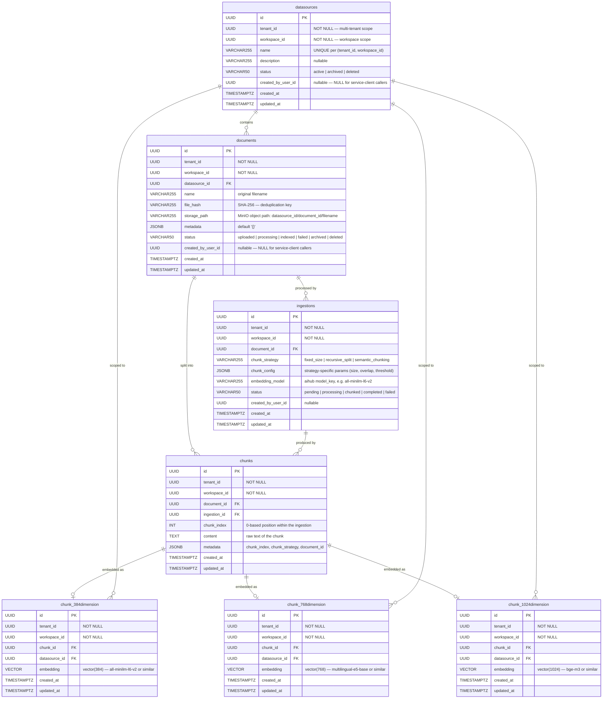

# DataHub — Database Schema



---

## Key Constraints

| Constraint | Table | Description |
|---|---|---|
| `uq_datasources_tenant_workspace_name` | `datasources` | Name unique per tenant+workspace |
| `uq_documents_tenant_workspace_datasource_file_hash` | `documents` | Dedup: same file cannot be uploaded twice to the same datasource |
| `fk_documents_datasource_scope` | `documents` | FK on `(datasource_id, tenant_id, workspace_id)` — ensures documents stay within the same tenant+workspace as their datasource |
| `uq_chunks_ingestion_chunk_index` | `chunks` | Idempotent chunk insertion: `ON CONFLICT ... DO UPDATE` |
| `uq_chunk_384_chunk_scope` | `chunk_384dimension` | One 384-dim embedding per chunk per tenant+workspace |
| HNSW indexes | All `chunk_*dimension` tables | pgvector HNSW index with `vector_cosine_ops` for ANN search |

---

## Cascade Deletes

All foreign keys use `ON DELETE CASCADE`. Deleting a **datasource** removes:
- All its documents → all their ingestions → all their chunks → all dimension embeddings

Deleting a **document** removes:
- Its ingestions → its chunks → its embeddings

Deleting an **ingestion** removes:
- Its chunks → their embeddings (in the dimension tables via FK on chunks)

---

## Embedding Tables and Model Mapping

| Table | Dimensions | Models (aihub model_key) |
|---|---|---|
| `chunk_384dimension` | 384 | `all-minilm-l6-v2` |
| `chunk_768dimension` | 768 | `multilingual-e5-base` |
| `chunk_1024dimension` | 1024 | `bge-m3` |

The mapping from returned vector length to table name is enforced identically in both `data-worker/internal/worker/embed_worker.go` and `datahub/internal/repository/search_repository.go`. Any new embedding model that produces a different dimension count would require a new table.

---

## Vector Search SQL

Search is performed against the dimension table matching the query vector length:

```sql
SELECT e.chunk_id, c.content, 1 - (e.embedding <=> $1::vector) AS score
FROM chunk_384dimension e
JOIN chunks c ON c.id = e.chunk_id
WHERE e.datasource_id = $2
  AND e.tenant_id     = $3
  AND e.workspace_id  = $4
ORDER BY e.embedding <=> $1::vector
LIMIT $5
```

`<=>` is pgvector's cosine distance operator. `1 - distance` converts to cosine **similarity** (higher = more relevant). Results are ordered by distance (ascending = most similar first).

---

## Demo Seed UUIDs

Migration: `migrations/postgres/datahub/002_demo_fintech_knowledge.sql`

| Entity | UUID |
|---|---|
| Datasource — Financial Reports | `00000000-0000-0000-0020-000000000001` |
| Datasource — Market Research | `00000000-0000-0000-0020-000000000002` |
| Document — AAPL Q4 FY2024 | `00000000-0000-0000-0021-000000000001` |
| Document — MSFT Q4 FY2024 | `00000000-0000-0000-0021-000000000002` |
| Document — NVDA Q4 FY2025 | `00000000-0000-0000-0021-000000000003` |
| Document — S&P 500 Sector Analysis | `00000000-0000-0000-0021-000000000004` |
| Document — Portfolio Risk Framework | `00000000-0000-0000-0021-000000000005` |
| Ingestion 1–5 | `00000000-0000-0000-0022-000000000001..005` |
| Chunks 1–21 | `00000000-0000-0000-0023-000000000001..021` |
| Embeddings 1–21 | `00000000-0000-0000-0024-000000000001..021` |

All seeded in the platform demo tenant (`00000000-0000-0000-0003-000000000001`) and workspace (`00000000-0000-0000-0005-000000000001`). All ingestions use `all-minilm-l6-v2` (384-dim) with `recursive_split` strategy (chunk_size=512, chunk_overlap=64).

---

## Ingestion Status Lifecycle

```
pending → processing → chunked → completed
                    ↘ ↗
                   failed
```

| Status | Set by | Trigger |
|---|---|---|
| `pending` | DataHub API | `POST /documents/{id}/ingestions` |
| `processing` | IngestionWorker | Job dequeued from ingestion queue |
| `chunked` | ChunkWorker | All chunks inserted, all embed jobs queued |
| `completed` | EmbedWorker | Embed counter reaches 0 |
| `completed` | IngestionWorker | Extracted text is empty (no chunks) |
| `failed` | Any worker | Unrecoverable error at any stage |

---

## Chunk Strategy Config Shapes

```json
// fixed_size
{ "chunk_size": 512, "chunk_overlap": 50 }

// recursive_split
{
  "chunk_size": 512,
  "chunk_overlap": 50,
  "separators": ["\n\n", "\n", ". ", " ", ""]
}

// semantic_chunking
{ "max_chunk_size": 1024, "similarity_threshold": 0.4 }
```

All fields are optional — each strategy applies its own defaults when omitted.
