# DataHub & Data-Worker — Features & Flow Sequences

## Features

---

### 1. DataHub API Service

DataHub is the HTTP-facing service that manages the full lifecycle of knowledge data — from raw file storage through to vector-indexed, searchable chunks. It is tenant-and-workspace scoped: every entity belongs to a `(tenant_id, workspace_id)` pair and queries are always filtered by both, preventing any cross-tenant data access.

#### 1.1 Datasource Management

A **datasource** is a named collection of documents, analogous to a folder or dataset. It is the top-level container that groups related documents and is the unit of access for vector search.

- **Create** — registers a new datasource with a name and optional description. A UUID v7 is generated as the primary key.
- **Get / List** — retrieves a single datasource by ID or lists all datasources belonging to the caller's tenant + workspace.
- **Update** — modifies the name or description of an existing datasource.
- **Delete** — removes the datasource record. All child documents, ingestions, chunks, and embeddings cascade-delete via database foreign keys.

Uniqueness is enforced at the `(tenant_id, workspace_id, name)` level — two workspaces inside the same tenant may reuse the same datasource name.

#### 1.2 Document Management

A **document** is a single uploaded file associated with a datasource. It carries the file's storage path in MinIO, a SHA-256 content hash for deduplication, and arbitrary JSON metadata for downstream use.

- **Upload (`multipart/form-data`)** — the handler reads the file bytes from the form, computes a SHA-256 hash, checks for an existing document with the same hash in the same datasource (`FindByHash`), and rejects with `409 Conflict` if a duplicate is found. On success, the file is uploaded to MinIO at path `<datasource_id>/<filename>` and the document record is persisted to `documents`.
- **List by datasource** — returns all documents belonging to a given datasource within the caller's tenant/workspace scope.
- **Get by ID** — retrieves a single document record.
- **Update** — allows modifying the `storage_path` (e.g., after a file migration) or `metadata` JSON.
- **Delete** — removes the document record; cascades to ingestions, chunks, and embeddings.

#### 1.3 Ingestion Management

An **ingestion** represents one processing run of a document: it pairs the document with a chunking strategy, a chunking config, and an embedding model. The same document can be ingested multiple times with different strategies or models.

- **Create (→ 202 Accepted)** — validates that `chunk_strategy` is one of `fixed_size`, `recursive_split`, or `semantic_chunking`; that `embedding_model` is non-empty; and that `chunk_config` is valid JSON. It inserts an ingestion record with `status = pending`, then publishes an `IngestionJob` to the Redis ingestion queue via `RPush`. Returns `202 Accepted` immediately — processing is asynchronous.
- **List by document** — returns all ingestion runs for a given document.
- **Get by ID** — retrieves a single ingestion record and its current status.
- **Delete** — removes the ingestion; cascades to chunks and embeddings.

**Status lifecycle** (after the fixes applied): `pending → processing → chunked → completed` (or `failed` at any stage).

#### 1.4 Chunk Management (read-only)

Chunks are produced exclusively by the `ChunkWorker`; the DataHub API exposes only read endpoints.

- **List by ingestion** — returns all chunks produced by a specific ingestion run, ordered by `chunk_index`.
- **Get by ID** — retrieves a single chunk with its `content` and `metadata`.

#### 1.5 Vector Search

The search endpoint performs an approximate nearest-neighbour cosine similarity search using **pgvector** against the pre-computed embedding tables.

- **Search** — accepts a raw `vector` (float array) and an optional `topK` (default 10). The vector length determines which dimension table to query (`chunk_384dimension`, `chunk_768dimension`, or `chunk_1024dimension`). The datasource ownership is verified first (tenant-scoped), then the query runs:
  ```sql
  SELECT chunk_id, content, (1 - (embedding <=> $vector)) AS score
  FROM chunk_<dim>dimension
  WHERE datasource_id=$1 AND tenant_id=$2 AND workspace_id=$3
  ORDER BY embedding <=> $vector
  LIMIT $topK
  ```
  Results are returned as `[{chunk_id, content, score}]` sorted by descending relevance.

**Design note:** the caller is expected to generate the query vector externally (e.g., by calling AIHub `/v1/embed`) before calling this endpoint. The API deliberately does not embed text inline to keep the service stateless with respect to AI models.

---

### 2. Data-Worker Service

Data-Worker is a background processing service with **no HTTP interface**. It runs three types of concurrent workers, each polling a Redis list queue. All workers share the same PostgreSQL pool and write results directly to the database. Worker concurrency is controlled by `WORKER_CONCURRENCY` (default 4), giving `3 × N` total goroutines.

#### 2.1 IngestionWorker

Responsible for the first stage of the pipeline: downloading the raw file from MinIO and extracting its plain text.

- Polls `datahub:queue:ingestion` via `BLPop` with a 5-second timeout.
- On dequeue, marks the ingestion as **`processing`** in the database immediately (prevents silent stalls from appearing as `pending`).
- Downloads the file bytes from MinIO using the `StoragePath` from the job.
- Detects file type from the `Filename` extension and dispatches to the appropriate parser:
  - `.txt` → direct byte-to-string conversion.
  - `.docx` → ZIP extraction → `word/document.xml` → XML unmarshal → concatenate `<w:t>` text nodes.
- If the extracted text is empty, the ingestion is silently skipped (no chunks produced).
- Pushes a `ChunkingJob` (carrying the raw text, strategy, config, model) to `datahub:queue:chunking`.
- On any error: marks ingestion as **`failed`** and pushes the raw payload to the dead-letter queue (`datahub:queue:dlq`).

#### 2.2 ChunkWorker

Responsible for splitting the extracted text into chunks and recording them in the database.

- Polls `datahub:queue:chunking` via `BLPop`.
- Fetches `datasource_id` from the `documents` table, **filtered by `tenant_id` AND `workspace_id`** (cross-tenant safety fix).
- Instantiates the correct chunker based on `chunk_strategy`:
  - **`fixed_size`** — splits text by rune count using `ChunkSize` runes per chunk and `ChunkOverlap` runes of overlap between adjacent chunks. Defaults: size=512, overlap=50.
  - **`recursive_split`** — recursively splits by a prioritised list of separators (`\n\n`, `\n`, `. `, ` `, `""`). Pieces still larger than `ChunkSize` are re-split with the next separator. Small pieces are merged with overlap. Defaults: size=512, overlap=50, standard separators.
  - **`semantic_chunking`** — splits into sentences, then merges adjacent sentences whose TF-weighted bag-of-words cosine similarity exceeds `SimilarityThreshold`, as long as the merged size stays within `MaxChunkSize`. Defaults: maxSize=1000, threshold=0.5.
- If the text produces **zero chunks** (e.g., blank document), marks ingestion as `completed` immediately and exits.
- Otherwise, sets a Redis counter `datahub:embed:remaining:<ingestion_id> = N` **before** pushing any embed jobs (avoids a race where all embeds complete before the counter is visible).
- For each chunk: inserts a row into `chunks` (with `chunk_index`, `content`, JSON metadata) and pushes an `EmbedJob` to `datahub:queue:embedding`.
- Updates ingestion status to **`chunked`** after all chunks are inserted and all embed jobs are queued.
- On error: marks ingestion as `failed` and pushes to DLQ.

#### 2.3 EmbedWorker

Responsible for generating embeddings via AIHub and storing them in the appropriate pgvector table.

- Polls `datahub:queue:embedding` via `BLPop`.
- Calls AIHub: `POST {AIHUB_URL}/v1/embed` with `{model, input: [chunk_text]}`. The HTTP client has a 60-second timeout.
- Determines the target table from the vector dimension returned:
  - 384 → `chunk_384dimension`
  - 768 → `chunk_768dimension`
  - 1024 → `chunk_1024dimension`
  - Any other dimension → error (pushed to DLQ).
- Inserts the embedding using pgvector's literal syntax (`[f1,f2,...]::vector`) with `ON CONFLICT (id) DO NOTHING` for idempotency.
- Decrements the Redis counter `datahub:embed:remaining:<ingestion_id>`. When the counter reaches **0**, all chunks for the ingestion have been embedded and the ingestion is updated to **`completed`**.
- On error: pushes the raw job payload to the DLQ. The ingestion is **not** immediately failed on a single embed error — only the counter increment is skipped, so a re-processed job can still complete it.

#### 2.4 Dead-Letter Queue

All three workers push failed payloads to `datahub:queue:dlq` (configurable via `REDIS_DLQ_KEY`). Each DLQ entry is a JSON object:
```json
{ "queue": "<source_queue>", "payload": "<original_json>", "error": "<error_message>" }
```
The DLQ is a Redis list, so a separate consumer or admin tool can inspect, replay, or discard entries at any time.

---

### 3. Queue Contract

| Queue key | Producer | Consumer | Job type |
|---|---|---|---|
| `datahub:queue:ingestion` | DataHub `IngestionService` | `IngestionWorker` | `IngestionJob` |
| `datahub:queue:chunking` | `IngestionWorker` | `ChunkWorker` | `ChunkingJob` |
| `datahub:queue:embedding` | `ChunkWorker` | `EmbedWorker` | `EmbedJob` |
| `datahub:queue:dlq` | All workers (on error) | Admin / replay tool | DLQ entry |

All queues use Redis List with `RPush` (producer) and `BLPop` (consumer) — simple FIFO.

---

### 4. Database Tables

| Table | Owner | Purpose |
|---|---|---|
| `datasources` | DataHub | Named document collections per tenant/workspace |
| `documents` | DataHub | Uploaded files with hash, MinIO path, metadata |
| `ingestions` | DataHub (write), Workers (status updates) | Processing runs — one per document+strategy+model |
| `chunks` | ChunkWorker | Text fragments produced by chunking |
| `chunk_384dimension` | EmbedWorker | pgvector embeddings, 384-dim |
| `chunk_768dimension` | EmbedWorker | pgvector embeddings, 768-dim |
| `chunk_1024dimension` | EmbedWorker | pgvector embeddings, 1024-dim |

All tables use `(tenant_id, workspace_id)` composite scoping with cascading foreign key deletes.

---

## Flow Sequences

---

### Flow 1 — Sign Up & Bootstrap (prerequisite)

> Not part of DataHub itself, but required before any DataHub call. Included for completeness.

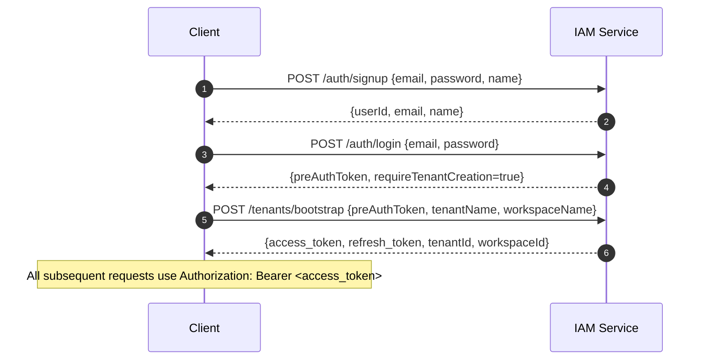

---

### Flow 2 — Create Datasource

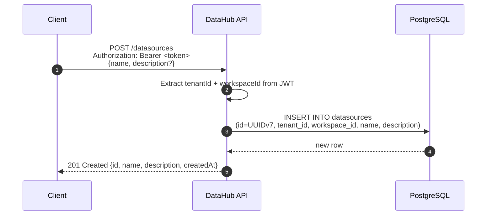

---

### Flow 3 — Upload Document

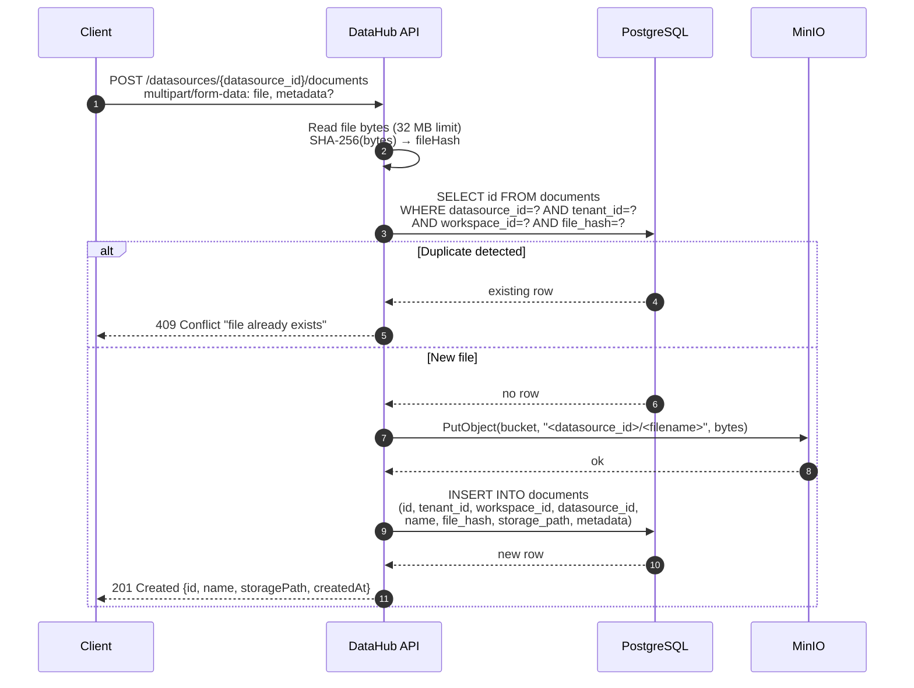

---

### Flow 4 — Create Ingestion (trigger async pipeline)

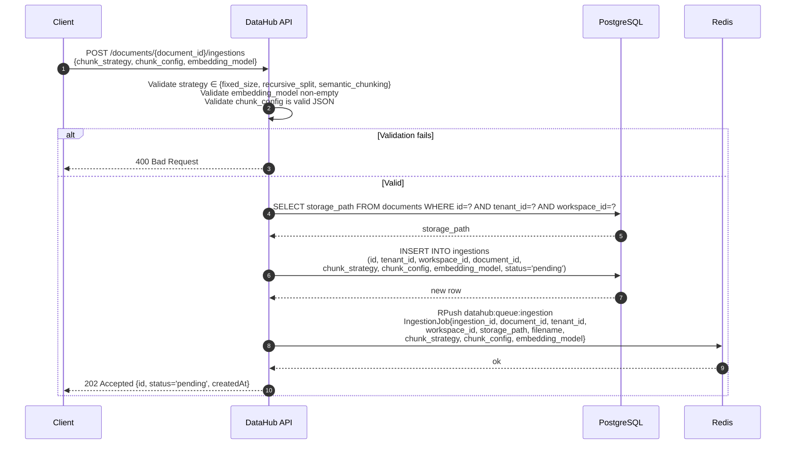

---

### Flow 5 — IngestionWorker (stage 1: download + parse)

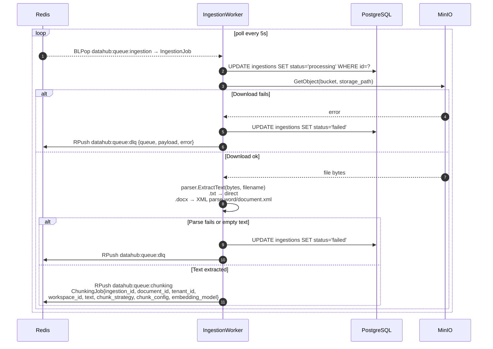

---

### Flow 6 — ChunkWorker (stage 2: split + enqueue embeds)

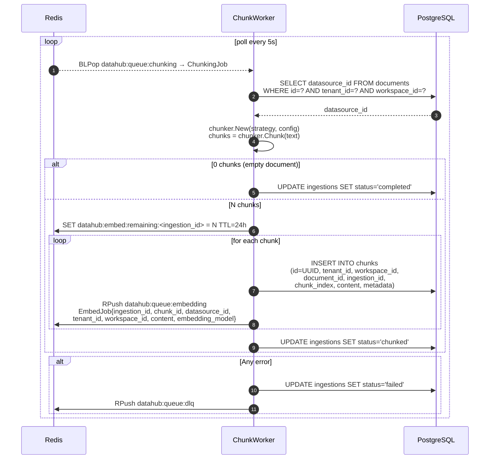

---

### Flow 7 — EmbedWorker (stage 3: embed + store vectors)

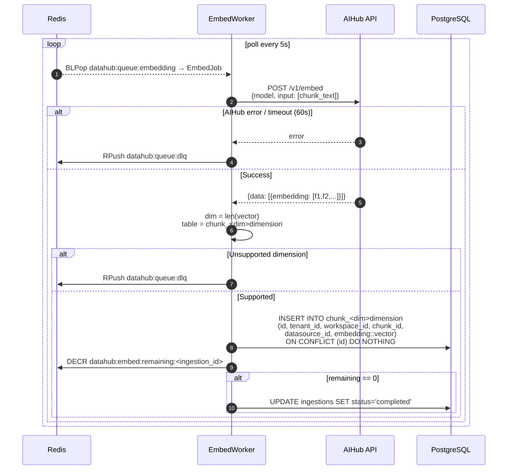

---

### Flow 8 — Vector Search

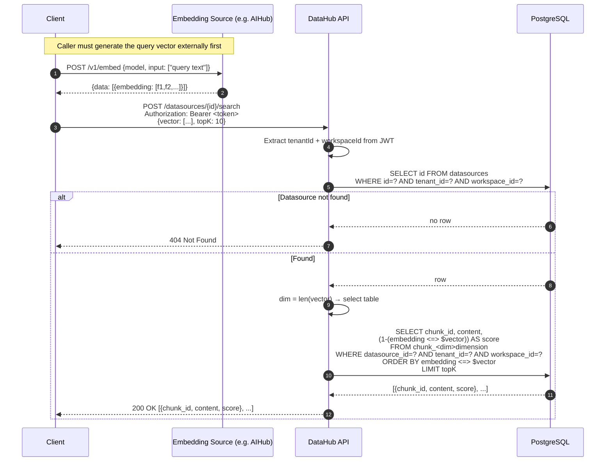

---

### Flow 9 — Full End-to-End Pipeline

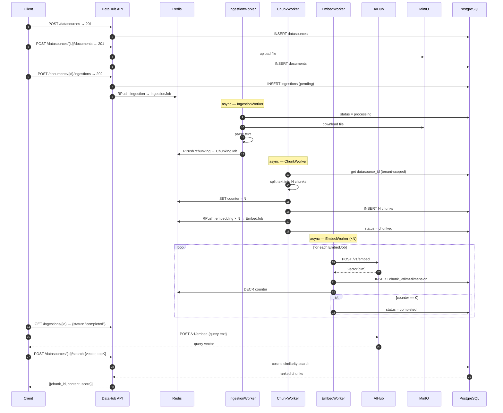

        DocRepo-->>DocSvc: DocumentResponse
        DocSvc-->>DH: DocumentResponse
        DH-->>C: 201 DocumentResponse
    end
```

## Trigger Ingestion

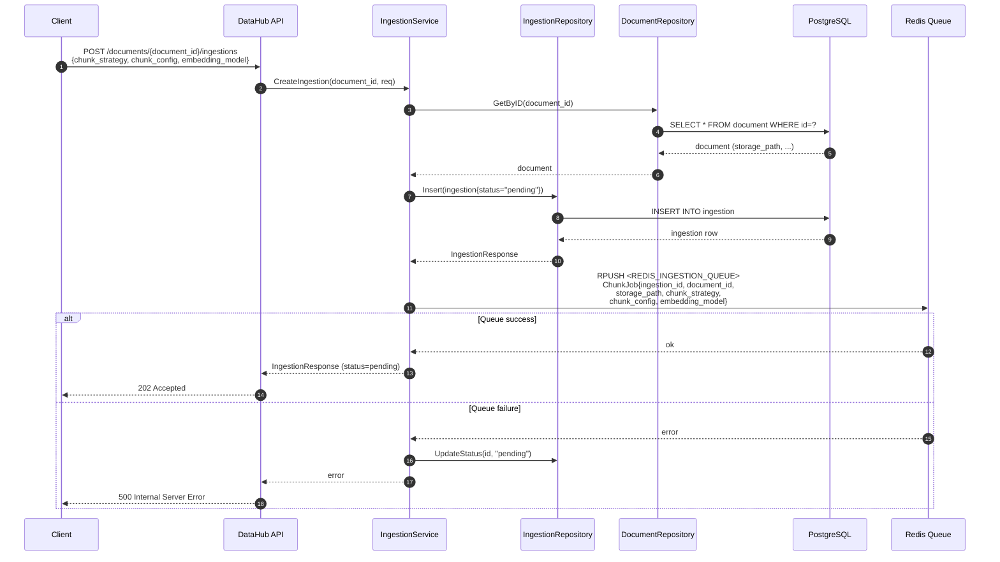

## Async Ingestion Processing (data-worker)

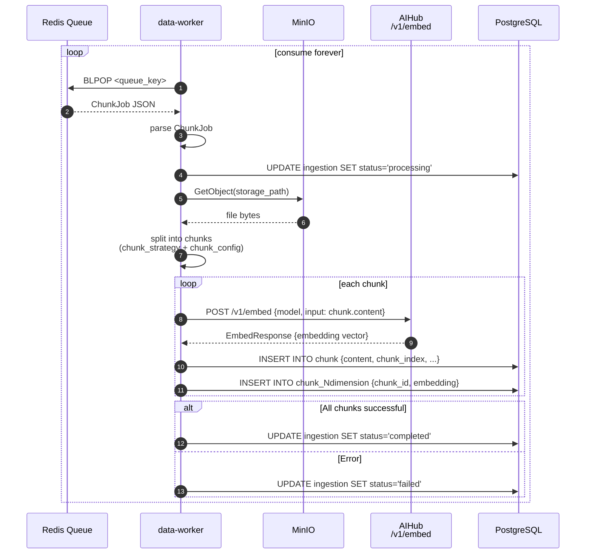

## Datasource CRUD

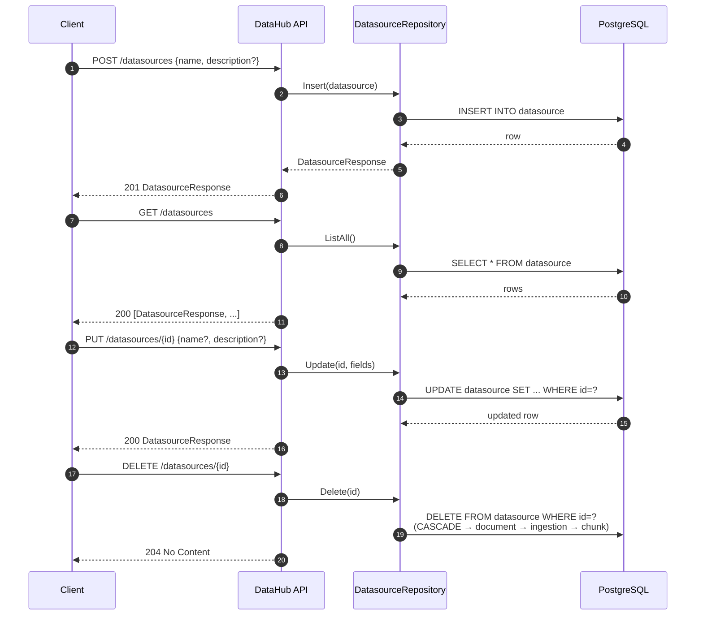

## Query Chunks (read-only)

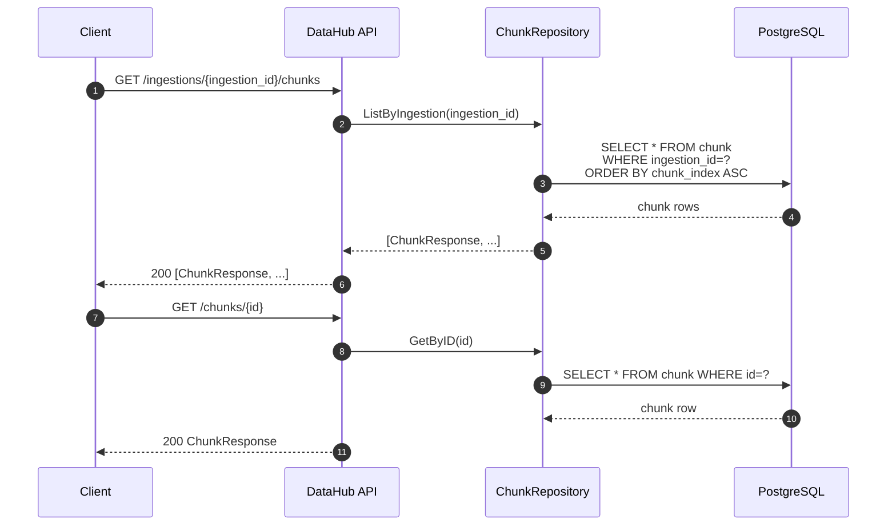
