# IAM Service — Database Schema

## Entity-Relationship Diagram

```mermaid
erDiagram
    tenants {
        UUID        id          PK
        VARCHAR100  code        "UNIQUE — human-readable slug"
        VARCHAR255  name
        VARCHAR50   status      "active | inactive"
        VARCHAR100  plan_key    "basic | ..."
        JSONB       settings
        TIMESTAMPTZ created_at
        TIMESTAMPTZ updated_at
    }

    users {
        UUID        id                  PK
        VARCHAR255  email               "UNIQUE"
        VARCHAR255  name
        TEXT        password_hash       "nullable — bcrypt / argon2id"
        VARCHAR100  password_algorithm  "nullable — default bcrypt"
        BOOLEAN     email_verified      "default FALSE"
        TEXT        avatar_url          "nullable"
        VARCHAR50   status              "active | inactive"
        TIMESTAMPTZ last_login_at       "nullable"
        TIMESTAMPTZ created_at
        TIMESTAMPTZ updated_at
    }

    memberships {
        UUID        id          PK
        UUID        tenant_id   FK
        UUID        user_id     FK
        VARCHAR50   status      "active | inactive"
        TIMESTAMPTZ joined_at
        TIMESTAMPTZ created_at
        TIMESTAMPTZ updated_at
    }

    workspaces {
        UUID        id                  PK
        UUID        tenant_id           FK
        VARCHAR100  code                "UNIQUE within tenant"
        VARCHAR255  name
        TEXT        description         "nullable"
        VARCHAR50   status              "active | inactive"
        JSONB       settings
        UUID        created_by_user_id  FK "nullable"
        TIMESTAMPTZ created_at
        TIMESTAMPTZ updated_at
    }

    workspace_memberships {
        UUID        id              PK
        UUID        tenant_id
        UUID        workspace_id    FK
        UUID        membership_id   FK
        VARCHAR50   status          "active | inactive"
        TIMESTAMPTZ joined_at
        TIMESTAMPTZ created_at
        TIMESTAMPTZ updated_at
    }

    permissions {
        UUID        id          PK
        UUID        tenant_id   FK "nullable — NULL = platform-wide"
        VARCHAR200  key         "UNIQUE per scope"
        VARCHAR100  resource
        VARCHAR100  action
        TEXT        description "nullable"
        BOOLEAN     is_system   "default TRUE — system perms cannot be deleted"
        TIMESTAMPTZ created_at
    }

    roles {
        UUID        id          PK
        UUID        tenant_id   FK "nullable — NULL = platform-level"
        VARCHAR150  key         "UNIQUE per tenant (partial index)"
        VARCHAR255  name
        VARCHAR50   scope_type  "platform | tenant | workspace"
        TEXT        description "nullable"
        BOOLEAN     is_system   "default TRUE"
        TIMESTAMPTZ created_at
        TIMESTAMPTZ updated_at
    }

    role_permissions {
        UUID        role_id       FK
        UUID        permission_id FK
        TIMESTAMPTZ created_at
    }

    membership_roles {
        UUID        membership_id FK
        UUID        role_id       FK
        TIMESTAMPTZ created_at
    }

    workspace_membership_roles {
        UUID        workspace_membership_id FK
        UUID        role_id                 FK
        TIMESTAMPTZ created_at
    }

    service_clients {
        UUID        id                      PK
        UUID        tenant_id               FK "nullable"
        VARCHAR150  client_id               "UNIQUE"
        VARCHAR255  service_name
        TEXT        secret_hash             "bcrypt"
        VARCHAR100  secret_algorithm        "default bcrypt"
        JSONB       allowed_audiences       "array of audience strings"
        INTEGER     access_token_ttl_seconds "default 3600"
        TEXT        description             "nullable"
        BOOLEAN     is_active               "default TRUE"
        TIMESTAMPTZ created_at
        TIMESTAMPTZ updated_at
    }

    service_client_permissions {
        UUID        service_client_id FK
        UUID        permission_id     FK
        TIMESTAMPTZ created_at
    }

    user_sessions {
        UUID        id                  PK
        UUID        user_id             FK
        UUID        tenant_id           FK "nullable"
        UUID        workspace_id        FK "nullable"
        TEXT        session_token_hash  "nullable — SHA-256/Base64(refresh_token)"
        VARCHAR50   auth_method         "default password"
        TEXT        ip_address          "nullable"
        TEXT        user_agent          "nullable"
        TIMESTAMPTZ expires_at
        TIMESTAMPTZ revoked_at          "nullable — NULL = still valid"
        TIMESTAMPTZ last_used_at        "nullable"
        TIMESTAMPTZ created_at
    }

    oauth_signing_keys {
        UUID        id                      PK
        VARCHAR255  key_id                  "UNIQUE — e.g. iam-rs256-2026-01"
        VARCHAR50   algorithm               "default RS256"
        JSONB       public_jwk              "public key — exposed via JWKS"
        TEXT        encrypted_private_jwk   "AES-encrypted private key"
        VARCHAR255  encryption_key_id       "nullable — KMS / Vault key ref"
        VARCHAR50   status                  "active | retired | revoked"
        TIMESTAMPTZ not_before
        TIMESTAMPTZ expires_at              "nullable"
        TIMESTAMPTZ created_at
    }

    features {
        UUID        id          PK
        VARCHAR150  key         "UNIQUE — e.g. agent_studio, data_hub"
        VARCHAR255  name
        TEXT        description "nullable"
        TIMESTAMPTZ created_at
    }

    feature_entitlement {
        UUID        id          PK
        UUID        tenant_id   FK
        UUID        feature_id  FK
        BOOLEAN     enabled     "default TRUE"
        JSONB       config
        TIMESTAMPTZ created_at
        TIMESTAMPTZ updated_at
    }

    model_entitlement {
        UUID        id                  PK
        UUID        tenant_id           FK
        VARCHAR150  model_key           "internal model key"
        VARCHAR50   operation_type      "chat | embed | rerank"
        BOOLEAN     allowed             "default TRUE"
        INTEGER     rpm_limit           "nullable"
        INTEGER     tpm_limit           "nullable"
        BIGINT      daily_token_limit   "nullable"
        BIGINT      monthly_token_limit "nullable"
        JSONB       config
        TIMESTAMPTZ created_at
        TIMESTAMPTZ updated_at
    }

    %% Identity
    tenants        ||--o{ memberships              : "tenant has members"
    users          ||--o{ memberships              : "user joins tenant"
    tenants        ||--o{ workspaces               : "tenant owns workspaces"
    users          ||--o{ workspaces               : "created_by (nullable)"
    workspaces     ||--o{ workspace_memberships    : "workspace has members"
    memberships    ||--o{ workspace_memberships    : "membership grants workspace access"

    %% Authorization
    tenants        ||--o{ roles                    : "tenant owns custom roles (nullable)"
    tenants        ||--o{ permissions              : "tenant owns custom permissions (nullable)"
    roles          ||--o{ role_permissions         : "role bundles permissions"
    permissions    ||--o{ role_permissions         : "permission assigned to roles"
    memberships    ||--o{ membership_roles         : "tenant-level role assignment"
    roles          ||--o{ membership_roles         : ""
    workspace_memberships ||--o{ workspace_membership_roles : "workspace-level role assignment"
    roles          ||--o{ workspace_membership_roles : ""

    %% M2M
    tenants        ||--o{ service_clients          : "tenant owns service clients (nullable)"
    service_clients ||--o{ service_client_permissions : "direct machine permissions"
    permissions    ||--o{ service_client_permissions : ""

    %% Sessions
    users          ||--o{ user_sessions            : "user session per login"
    tenants        ||--o{ user_sessions            : "session scoped to tenant (nullable)"
    workspaces     ||--o{ user_sessions            : "session scoped to workspace (nullable)"

    %% Entitlements
    tenants        ||--o{ feature_entitlement      : "tenant feature access"
    features       ||--o{ feature_entitlement      : ""
    tenants        ||--o{ model_entitlement        : "tenant model access + limits"
```

---

## Table Reference

### Identity Layer

#### `tenants`
One row per customer/company. The root billing and access boundary.
- `code` — human-readable unique slug (e.g. `acme-corp`). Used in bootstrap flow.
- `plan_key` — controls which features/models can be entitled to this tenant.
- `settings` — JSONB reserved for tenant-level config.

#### `users`
Human platform users only. Service accounts live in `service_clients`.
- `password_hash` is nullable so future SSO/OAuth users can be created without a password.
- `status = inactive` → all login attempts rejected (soft-delete).

---

### Membership Layer

#### `memberships`
Joins a `user` to a `tenant`. A user may belong to many tenants simultaneously.
- `status = inactive` → user is removed from the tenant (soft-delete; preserves audit trail).
- Unique constraint `(tenant_id, user_id)`.

#### `workspaces`
A department, team, or project within a tenant. All Studio resources (agents, tools, prompts) belong to a workspace.
- `code` is unique within `tenant_id`.
- `created_by_user_id` is set to the creator for audit; nullable to allow FK-safe user deletion.

#### `workspace_memberships`
Joins a `membership` to a `workspace`. A user must have a tenant `membership` before they can have a workspace membership.
- Composite FK: `(workspace_id, tenant_id)` → enforces workspace belongs to same tenant as membership.
- Composite FK: `(membership_id, tenant_id)` → enforces membership belongs to same tenant.

---

### Authorization Layer

#### `permissions`
Atomic capabilities checked by backend code (e.g. `agent:run`, `datasource:delete`).
- `tenant_id IS NULL` — platform permission, visible to all tenants. Cannot be deleted by tenant admins.
- `tenant_id = UUID` — tenant-scoped custom permission, visible only to that tenant.
- Unique indexes are partial: platform-level uniqueness (`WHERE tenant_id IS NULL`) and per-tenant uniqueness (`WHERE tenant_id IS NOT NULL`) are enforced separately, so the same key/resource+action can exist both at platform level and per tenant without conflict.

#### `roles`
Bundles of permissions. Roles have three scopes:

| `scope_type` | Assigned to | System roles seeded |
|---|---|---|
| `platform` | any membership across all tenants | `platform_admin` |
| `tenant` | `memberships` (via `membership_roles`) | `tenant_admin` |
| `workspace` | `workspace_memberships` (via `workspace_membership_roles`) | `workspace_owner`, `workspace_member`, `agent_builder`, `viewer` |

- `tenant_id IS NULL` — platform/system role, visible to all tenants.
- `tenant_id = UUID` — custom role created by that tenant.
- `is_system = true` → immutable; cannot be modified or deleted.
- Unique key index: partial `WHERE tenant_id IS NULL` for platform keys; standard `(tenant_id, key)` for tenant-scoped.

#### `role_permissions`
Many-to-many junction between `roles` and `permissions`. Composite PK `(role_id, permission_id)`.

#### `membership_roles`
Assigns a **tenant-level** role to a `membership`. Determines what a user can do at the tenant level.
- Only `scope_type = 'tenant'` roles are valid here (enforced in service layer).

#### `workspace_membership_roles`
Assigns a **workspace-level** role to a `workspace_membership`. Determines what a user can do within a specific workspace.
- Only `scope_type = 'workspace'` roles are valid here.

---

### M2M Layer

#### `service_clients`
OAuth2 `client_credentials` clients for service-to-service communication.
- `client_id` is globally unique (not tenant-scoped).
- `secret_hash` — BCrypt hash of the plain secret. The plain secret is only returned at creation/rotation.
- `allowed_audiences` — JSONB array of audience strings embedded into the service-client access token (e.g. `["aihub", "datahub"]`). The current `/oauth/token` endpoint does not accept a requested audience parameter.
- `access_token_ttl_seconds` — per-client configurable TTL (default 3600).
- `is_active = false` → token requests rejected immediately.

#### `service_client_permissions`
Direct machine permissions assigned to a service client. Composite PK `(service_client_id, permission_id)`.
- Only permissions visible to the client's tenant (platform-level or tenant's own) can be assigned.

---

### Session Layer

#### `user_sessions`
One row per issued refresh token. Used for refresh/logout without a remote DB call on every access-token request.
- `session_token_hash` — SHA-256/Base64 hash of the refresh token string. Raw token is never stored.
- `revoked_at IS NULL` — session is active.
- `expires_at` — JWT expiration mirrored here so queries can filter without decoding the token.
- Partial index on `session_token_hash WHERE revoked_at IS NULL` (V2 migration) for fast session lookup during refresh and logout.

---

### Cryptography

#### `oauth_signing_keys`
Stores the IAM RSA key pair used to sign JWTs.
- `public_jwk` — the RSA public key in JWK format. This is what is served at `/.well-known/jwks.json`.
- `encrypted_private_jwk` — AES-encrypted JWK. Encryption key is stored in KMS/Vault; the key ID is in `encryption_key_id`.
- Only one row may have `status = 'active'` at a time (enforced by partial unique index).
- Old keys are set to `status = 'retired'` during rotation; downstream services can still verify tokens signed by retired keys until those tokens expire.

---

### Entitlement Layer

#### `features`
Platform capability flags (e.g. `agent_studio`, `data_hub`, `model_gateway`). Created by platform admins.

#### `feature_entitlement`
Grants a tenant access to a feature.
- `enabled = false` can disable a feature without revoking the entitlement row.
- `config` — JSONB for feature-specific settings.
- Unique constraint `(tenant_id, feature_id)`.

#### `model_entitlement`
Grants a tenant access to a specific AI model and enforces rate limits.
- `(tenant_id, model_key, operation_type)` is unique — e.g. ACME can have different limits for `gpt-4.1:chat` vs `gpt-4.1:embed`.
- All limit columns are nullable — `NULL` means no limit on that dimension.
- AIHub checks these limits on every model call and increments counters in Redis.

---

## Design Decisions

1. **Soft deletes everywhere**: `status = 'inactive'` instead of hard deletes on tenants, users, memberships, workspaces, workspace_memberships. This preserves the audit trail and prevents FK cascade surprises.

2. **Permissions in the JWT, not checked per-request**: Effective permissions are computed once at login/refresh and embedded in the access token. Downstream services read `permissions[]` directly from the JWT — no IAM roundtrip on each API call. Permissions are refreshed on every token refresh.

3. **Tenant-scoped permissions via partial indexes**: Standard UNIQUE constraints treat `NULL = NULL` as unequal in Postgres. The schema uses partial indexes (`WHERE tenant_id IS NULL` and `WHERE tenant_id IS NOT NULL`) to enforce uniqueness within each scope independently.

4. **Platform roles have `tenant_id = NULL`**: System roles (`platform_admin`, `tenant_admin`, `workspace_owner`, `workspace_member`) have no tenant — they are globally visible and immutable. Custom roles have `tenant_id = UUID`.

5. **Service clients are globally unique by `client_id`**: Even though clients can be scoped to a tenant, their `client_id` must be globally unique because it appears in JWT claims and is used for lookup without a tenant hint.

6. **Refresh token rotation**: Every refresh creates a new session row and revokes the old one. A stolen refresh token can only be used once before invalidation is detected.

7. **One active signing key at a time**: Enforced by a partial unique index on `status WHERE status = 'active'`. Retired keys remain in the table so in-flight tokens can still be verified.

---

## Migration History

| Flyway version | File | What it does |
|---|---|---|
| V1 | `V1__iam_init.sql` | Full initial schema — all 17 tables |
| V2 | `V2__session_token_hash_index.sql` | Partial index on `user_sessions(session_token_hash) WHERE revoked_at IS NULL` for fast refresh/logout lookup |
| V3 | `V3__permissions_tenant_scoping.sql` | Adds `tenant_id` column to `permissions`; drops global unique constraints; adds partial unique indexes for platform-level and tenant-scoped permissions |
| V4 | `V4__seed_system_roles.sql` | Seeds `platform_admin`, `tenant_admin`, `workspace_owner`, `workspace_member` with fixed UUIDs (idempotent) |
| V5 | `V5__seed_permissions_and_roles.sql` | Seeds system permissions; links `tenant_admin` and `workspace_owner` to all permissions; adds `agent_builder` and `viewer` workspace roles with their permission grants |
| V6 | `V6__provider_model_permissions.sql` | Adds `provider:manage` and `model:manage` system permissions; grants both to `platform_admin` role (fixed UUID `0001`) |
| V7 | `V7__seed_platform_admin.sql` | Seeds the platform tenant (`id = 00000000-0000-0000-0003-000000000001`), platform admin user (`admin@platform.dev`, bcrypt of `Admin@1234`), its membership, and assigns the `platform_admin` role — provides an initial super-admin account for bootstrap |
