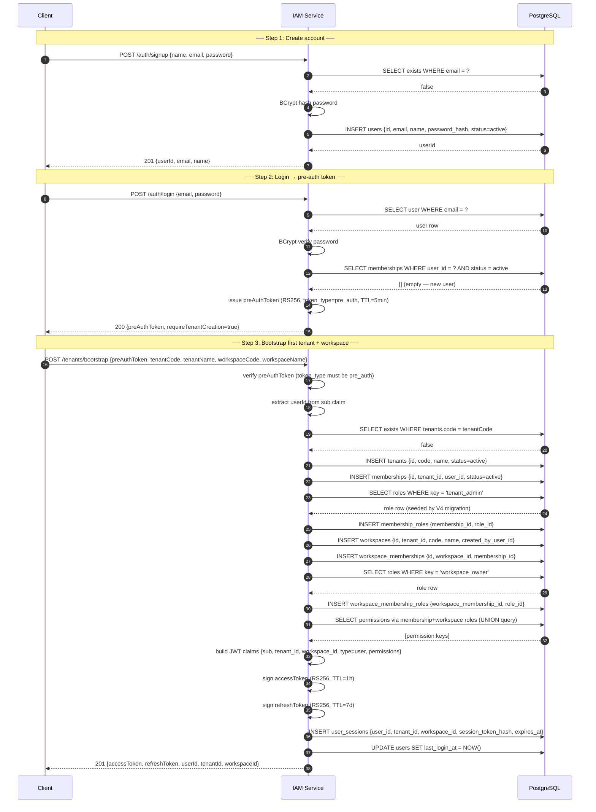
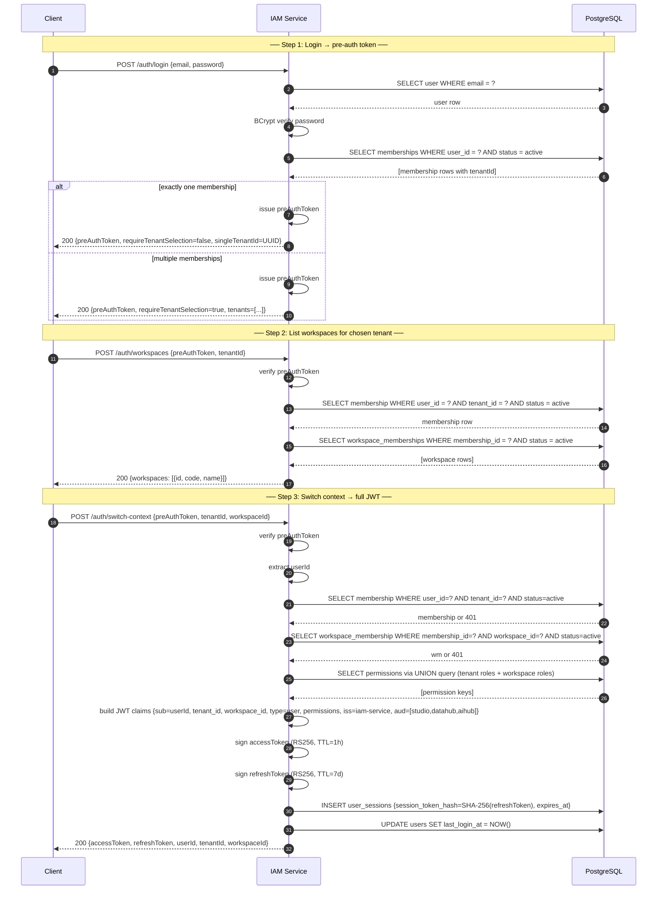
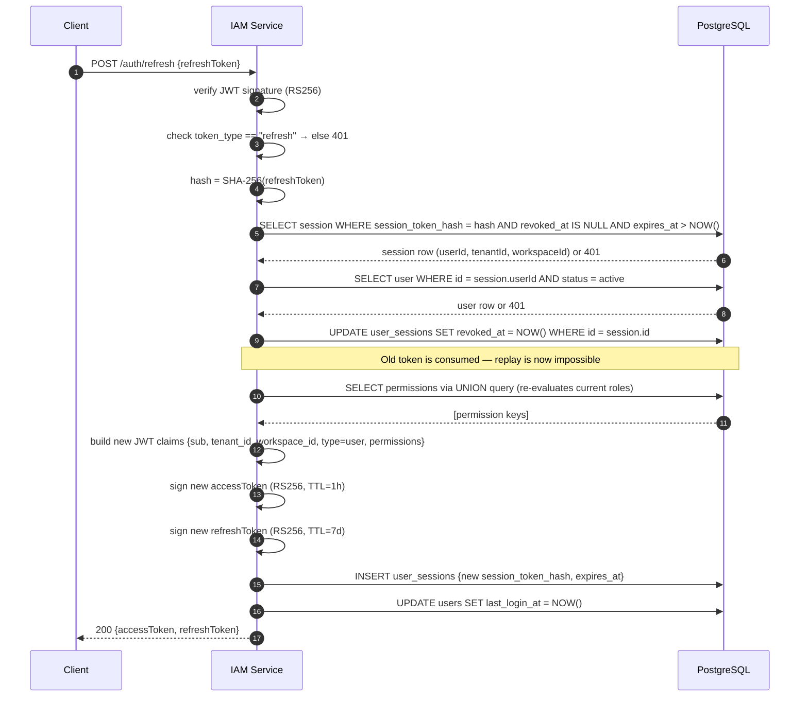
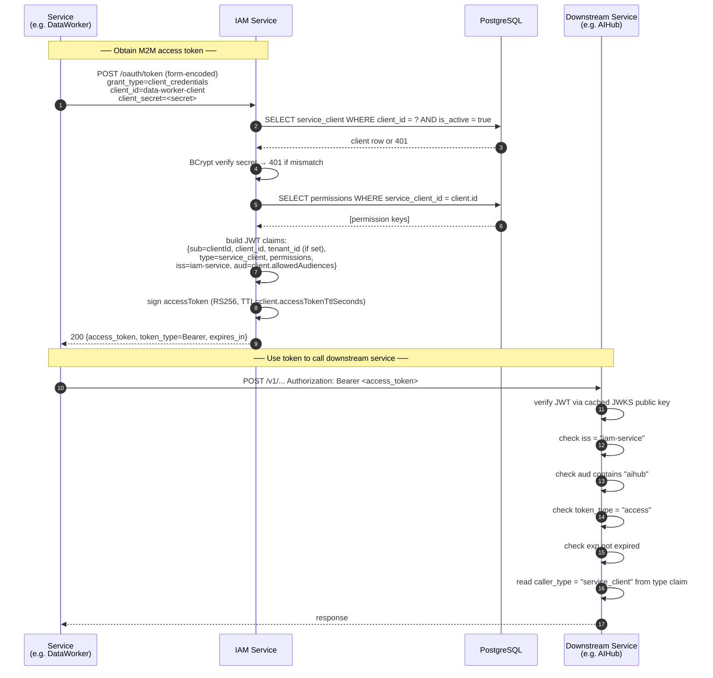
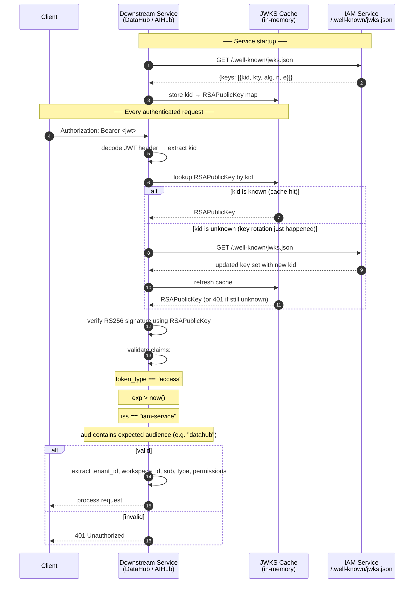
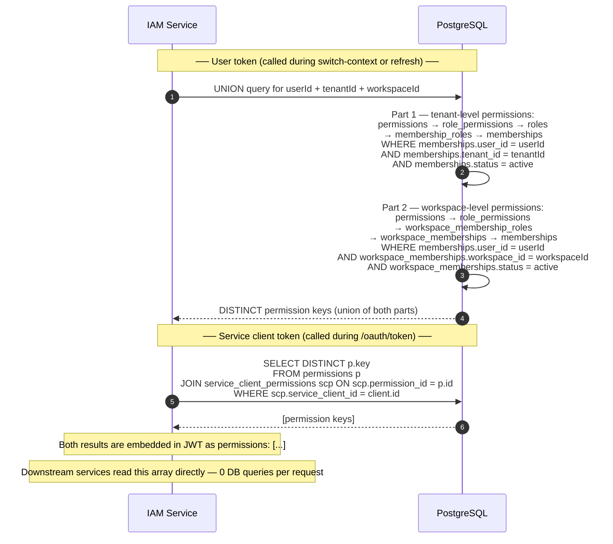
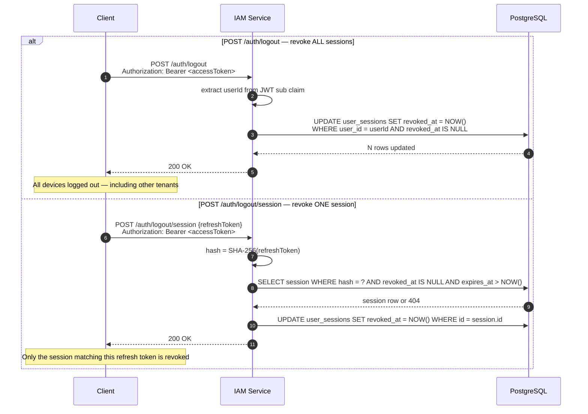
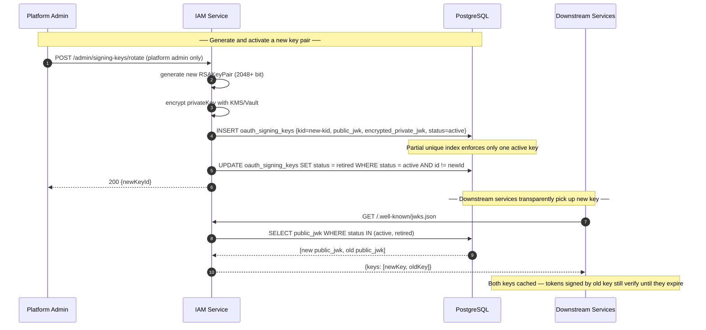

# IAM Service — Sequence Diagrams

## 1. New User — Sign Up + Bootstrap (full first-login flow)

The path for a brand-new user who has no tenant yet.

---

## 2. Returning User — Login + Context Selection

The path for a user who already has one or more tenants.

---

## 3. Token Refresh (with rotation)

Every refresh call rotates the refresh token. Old token is revoked before the new one is issued.

---

## 4. M2M — Service Client client_credentials

Used by services like DataWorker and Agent Orchestrator to obtain a Bearer token for calling other services.

---

## 5. Downstream JWT Verification (no IAM roundtrip)

How DataHub, AIHub, and other downstream services verify tokens locally using the cached JWKS public key. IAM is only called once per key rotation event, not on every request.

---

## 6. Permission Collection at Token Issuance

How IAM computes the `permissions` claim embedded in every access token. There is **no per-request DB call** on downstream services — permissions are computed once here.

---

## 7. Logout — Single Session vs All Sessions

---

## 8. Signing Key Rotation

How IAM rotates the RSA key pair used to sign JWTs without invalidating in-flight tokens.

